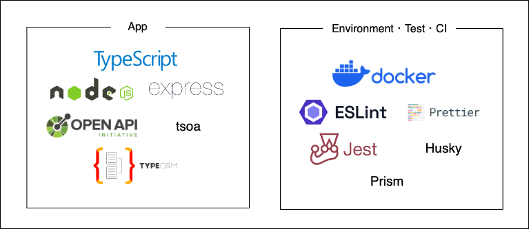

# Clean Architecture Node

This is a boilerplate for clean architecture and Node REST projects.

# Architecture

See [Qiita](https://qiita.com/Jiei-S/items/dbf06194f4858519bc61).


## Technology Stack



# Get Started

## Setup
```bash
$ make setup
```

Then, You need to set environment variables in `.env` file.

## Run

Run the following command. Server will start on http://localhost:4000.

```bash
$ make dev
```

# How To Use

## Create

```bash
$ curl --location 'http://localhost:4000/internal/projects' \
  --header 'Content-Type: application/json' \
  --header 'Accept: application/json' \
  --data '{
    "name": "test",
    "status": "active"
  }'
```

```json
{
  "id": "<ID>",
  "name": "test",
  "status": "active"
}
```

## Find

```bash
$ curl --location 'http://localhost:4000/internal/projects/<ID>'
```

```json
{
  "id": "<ID>",
  "name": "test",
  "status": "active"
}
```


# How To Development

## Generate API Client and Router

You need to update api client and router by running the following command.  

```bash
$ make api-gen
```

API Client will be generated in `api/<VERSION>/**` and router will be generated in `src/infrastructure/express`.


## Migration

You need to run the following commands to update migration.  

```bash
# generate
$ make migration-gen

# up
$ make migration-run

# down
$ make migration-revert
```

Migration will be generated in `src/infrastructure/typeorm/migrations/**`.


## Test

### Lint & Format

Automatically run when you commit.

### E2E Test

To run E2E test, you need to run the following commands.

```bash
# e2e container up and migration run
$ make e2e-up

# e2e run
$ make e2e-run
```
